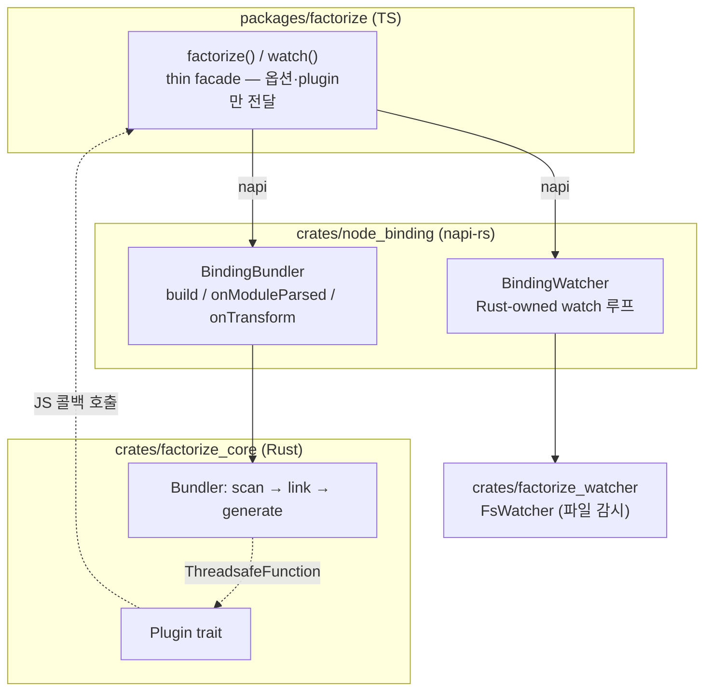
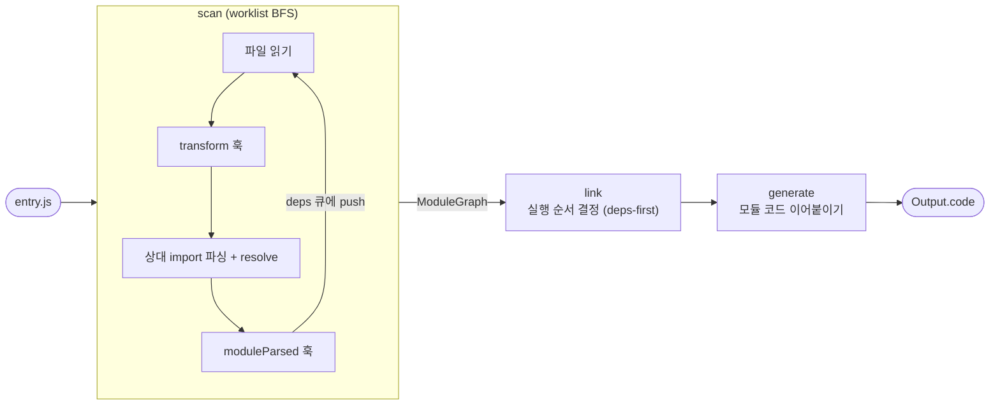

# factorize

rolldown식 구조의 학습용 번들러 — **thin JS/TS ↔ napi-rs ↔ Rust core**.
파이프라인(scan → link → generate)을 Rust core가 소유하고, JS는 옵션과 plugin 콜백만 넘긴다.

## 아키텍처



- plugin 훅(`moduleParsed`, `transform`)은 **Rust core가 napi `ThreadsafeFunction`으로 JS를 다시 호출**한다.
- watch 루프는 **Rust가 소유**하고, JS는 이벤트만 구독한다.

## 파이프라인



| 단계 | 하는 일 |
| --- | --- |
| **scan** | entry에서 상대 import를 따라가며 module graph 구성 (worklist BFS) |
| **link** | 실행 순서 결정 — deps가 먼저 오도록 정렬 |
| **generate** | 모듈 코드를 순서대로 이어붙여 하나의 번들로 |

## 실행

### CLI

```sh
cargo run -p factorize_cli -- packages/factorize/fixture/entry.js
```

입력 (`fixture/entry.js` → `dep.js`, `meta/version.js` import):

```js
// entry.js
import { hello } from "./dep.js";
import { VERSION } from "./meta/version.js";
console.log(hello(), VERSION);
```

실제 출력 — **의존성이 먼저(version → dep → entry) 배치**된 게 보인다:

```js
// === /.../fixture/meta/version.js ===
export const VERSION = "0.1.0";

// === /.../fixture/dep.js ===
export function hello() {
  return "hello from factorize";
}

// === /.../fixture/entry.js ===
import { hello } from "./dep.js";
import { VERSION } from "./meta/version.js";

console.log(hello(), VERSION);
```

### JS API

```sh
cd packages/factorize
npm run build:binding   # Rust → .node 생성 (코드 바꿀 때마다)
npm start               # 빌드 데모 (plugin: moduleParsed + transform)
npm run watch           # watch 데모 (파일 변경 시 Rust가 rebuild)
```

```ts
import { factorize, watch } from "./src/factorize";

// 빌드 + plugin
const build = factorize({ input: "./entry.js" }, [
  {
    moduleParsed: (id) => console.log("parsed:", id),
    transform: (code, id) => `/* ${id} */\n${code}`,
  },
]);
const out = await build.build();

// watch — 루프는 Rust가 소유, JS는 이벤트만 구독
const w = watch({ input: "./entry.js" });
w.on("bundle_end", (e) => console.log(`${e.modules.length} modules`));
w.on("change", (e) => console.log("changed:", e.path));
```

## 스코프

번들러 핵심을 최소로 구현해 **rolldown의 JS↔napi↔Rust 경계 패턴**을 익히는 게 목표.
실제 파서(oxc)·tree-shaking·code-splitting은 단순화돼 있다 — 자세한 전환 기록은 `ROLLDOWN_MIGRATION.md`.
</content>
</invoke>
